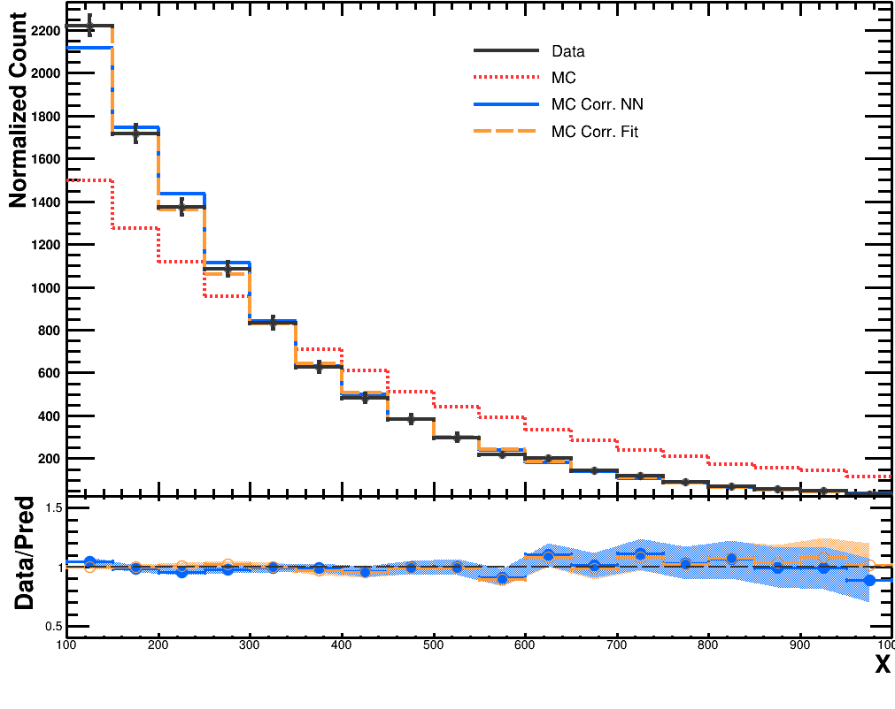
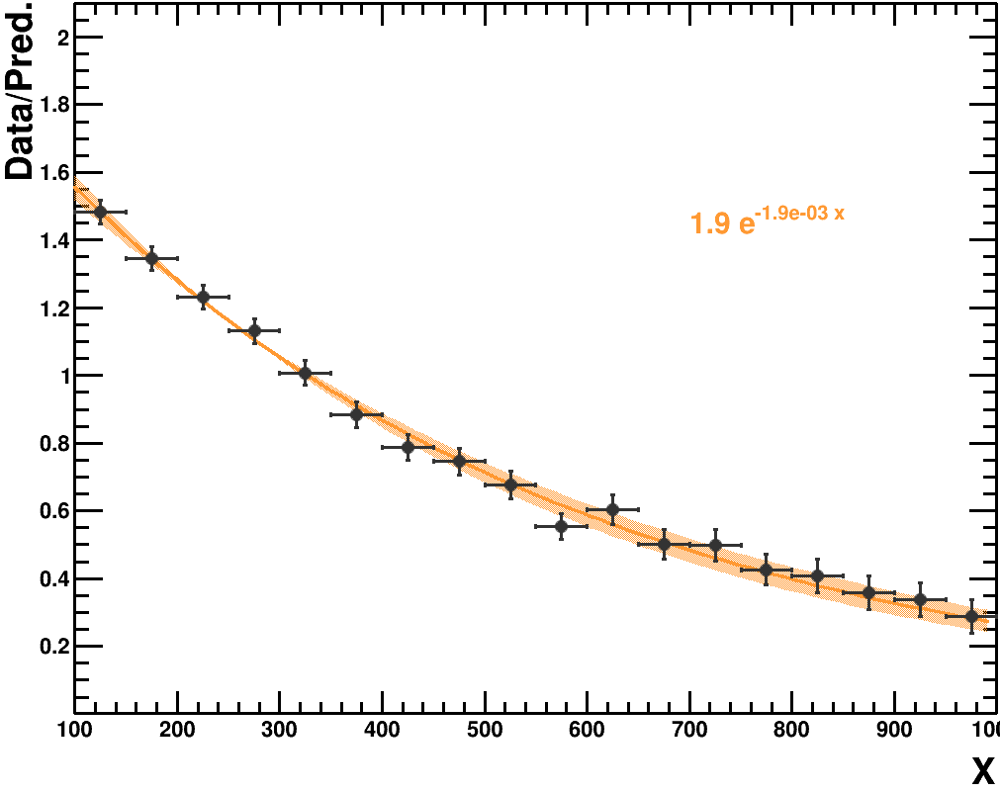

## Predicting PDF by using Bayesian interpretation of Neural Networks


This example is aiming to have reweighting function for miss modelled predictions based on the determination of probability density functions by using Neural Networks
The related paper can be found [here](https://arxiv.org/abs/physics/9807018)

Toy-example considered by exponential function with different coefficients for data and MC,

```
root -l -b -q create_toy_data.cpp
```

An external python script which is using same framework has been prepared for calculating NN reweighting,

```
./train.py --ntup data.root data --ntup mc.root mc --conf config.conf
```

NN reweighting can be compared by correction with an exponential fit by using following,

```
root -l -b -q fit.cpp
```

  


#### Uncertainty

The uncertainty for NN reweighting can be calculated by using [MC dropout method](https://arxiv.org/pdf/1506.02142.pdf)  

The implementation included into framework for python "predict_with_uncertainty(x, model, n_iter=10)"

The NN reweighting with uncertainty:  
  


The exponential reweighting with uncertainty:  
  

@asonay